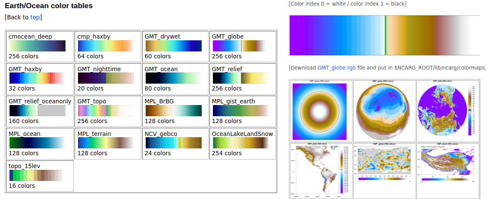

## Tips for linux command line

### PC's tips

**Burn bootable iso to usb by dd**

`sudo dd if=ubuntu.iso of=/dev/sdh bs=1024k status=progress && sync`

**Conver vector files using inkscape**

For .emf files. Pay attention filenames without spaces:

`for i in *.emf; do inkscape --file $i --export-plain-svg $i.svg; done`

**Conver RGB to CMYK color space in PDF file**

`gs -dSAFER -dBATCH -dNOPAUSE -dNOCACHE -sDEVICE=pdfwrite -sColorConversionStrategy=CMYK -dProcessColorModel=/DeviceCMYK -sOutputFile=output_CMYK.pdf Input.pdf`


### GIS' tips

**Transformation unref vector layer to ref one**

Coordinates legend: ungeoref_x ungeoref_y georef_x georef_y elevation:

`ogr2ogr -progress -f "GPKG" -a_srs EPSG:4326 -tps -gcp 4.407 -4,487 155 61.333333333 -gcp 8.22951 -678.36087 155 60.666666667 -gcp 497.170404 -3.639216 156 61.333333333 -gcp 506.459434 -676.671875 156 60.66666667 Tectonic_schema.gpkg Tectonic_schema_noref.gpkg`

**Color Table Gallery**

Many items of one with examples. Site is look like this. 

Link is https://www.ncl.ucar.edu/Document/Graphics/ColorTables/GMT_globe.shtml



**PDF: split one long page to two separete pages**

Get from https://unix.stackexchange.com/questions/405610/how-can-i-split-each-pdf-page-into-two-pages-using-the-command-line

```bash
pdftk input.pdf burst

pw=`cat doc_data.txt  | grep PageMediaDimensions | head -1 | awk '{print $2}'`
ph=`cat doc_data.txt  | grep PageMediaDimensions | head -1 | awk '{print $3}'`
w2=$(( pw / 2 ))
w2px=$(( w2*10 ))
hpx=$((  ph*10 ))
for f in  pg_[0-9]*.pdf ; do
  lf=left_$f
  rf=right_$f
  gs -o ${lf} -sDEVICE=pdfwrite -g${w2px}x${hpx} -c "<</PageOffset [0 0]>> setpagedevice" -f ${f}
  gs -o ${rf} -sDEVICE=pdfwrite -g${w2px}x${hpx} -c "<</PageOffset [-${w2} 0]>> setpagedevice" -f ${f}
done

ls -1 [lr]*_[0-9]*pdf | sort -n -k3 -t_ > fl
pdftk `cat fl`  cat output output.pdf 
```

**PDF: merge few jpg's to one pdf**

```bash
for i in *.JPG ; do convert "$i" -resize 26% -quality 75 "${i%.*}.pdf" ; done     
ls *.pdf > pdfs.txt
pdftk $(cat pdfs.txt) output final.pdf && rm $(cat pdfs.txt)
```

**PDF:  Optical Character Recognition (распознание текста)**

There is the  Tesseract command line programm. `sudo apt install tesseract-ocr-all` (for all languages).

Tesseract is used only `tiff`, `jpg`, `png` files! Before convert to the one single page file for OCR.

Scripts for that (for russian text file)

```bash
#!/bin/bash

tif_dir=tif
out_dir=out

first=000 
last=`ls $tif_dir | grep -o '[0-9]\{3\}' | sort -n | tail -1`

export LANG=ru_RU.UTF-8

for i in $(seq -w $first $last); do
  filename=nameOfSingleFile-$i.jpg
  echo "Processing $filename"
  
   tesseract -l rus "$tif_dir/$filename" "$out_dir/${filename%.jpg}.txt"
  
  echo "OCR complete for $filename"
done
```

Next - merge all txt in one file.

```bash
#!/bin/bash

input_dir=out
output_file=all.txt

first=000
last=171

echo "Merging files..."

touch $output_file

for i in $(seq -w $first $last); do
  filename=landscape-$i.txt.txt
  cat $input_dir/$filename >> $output_file
done

echo "Files merged to $output_file"
```


**RAID in my PC**

Get from https://www.dmosk.ru/miniinstruktions.php?mini=mdadm

`apt-get install mdadm` - устанавливаем mdadm.

`mdadm --zero-superblock --force /dev/sd{b,c}` - убиваем суперблоки у дисков.

Если есть старые данные, то - `wipefs --all --force /dev/sd{b,c}`.

`mdadm --create --verbose /dev/md0 -l 1 -n 2 /dev/sd{b,c}`, где `-l` - уровень рейда (1 - зеркалить два диска),
`-n 2` - количество дисков, `/dev/sd{b,c}` - диски которые объединяем.

`mdadm --detail --scan --verbose | awk '/ARRAY/ {print}' >> /etc/mdadm/mdadm.conf` добавляем в секцию `DEVICE partitions`
(через sydo ругалось в отказе доступа, внес вручную).

Далее форматируем RAID - `mkfs.ext4 /dev/md0`.

`cat /proc/mdstat` - проверяем состояние и синхронизацию дисков.


Для восстановления:

удаление сломаного - `mdadm /dev/md0 --remove /dev/sdc`.

`mdadm /dev/md0 --add /dev/sde` - добавляем новый. Должа начаться автоматическая синхронизация.

Увеличить скорость синхронизации - `echo '10000' > /proc/sys/dev/raid/speed_limit_min`. По дефолту min - 1000 Kb, max - 200 Mb.


Пересборка массива:

`mdadm --assemble --scan` - поиск необходимой конфигурации и восстановление RAID.

Указываем диски для пересборки - `mdadm --assemble /dev/md0 /dev/sdb /dev/sdc`.

**a multi-threading download**

`axel -a -n [Num_of_Thread] link1 link2 link3 ...`
